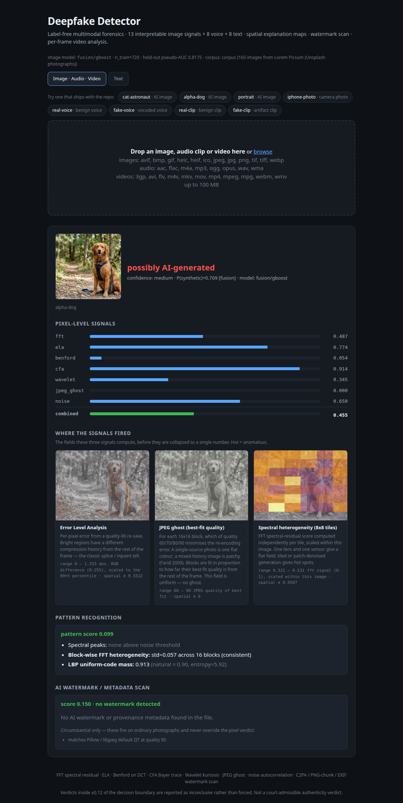
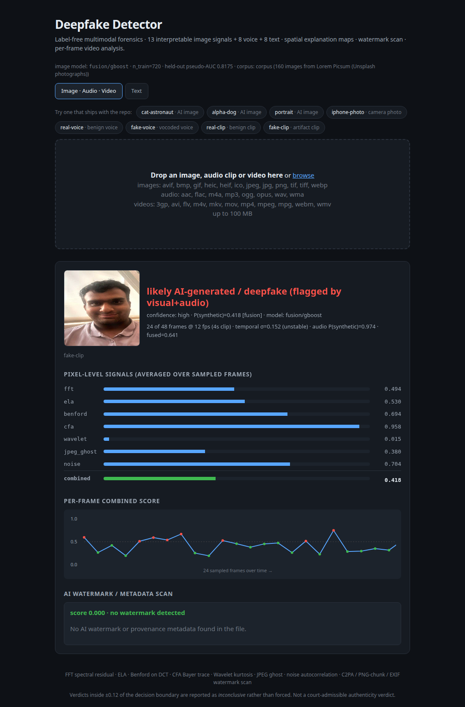
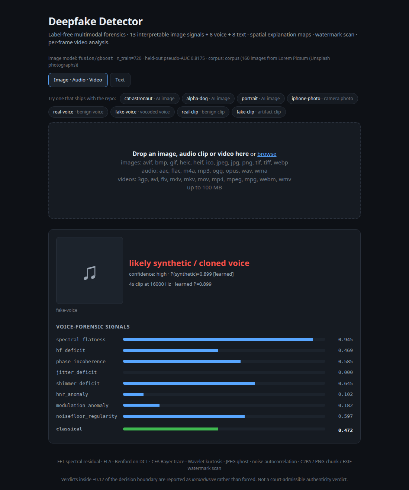
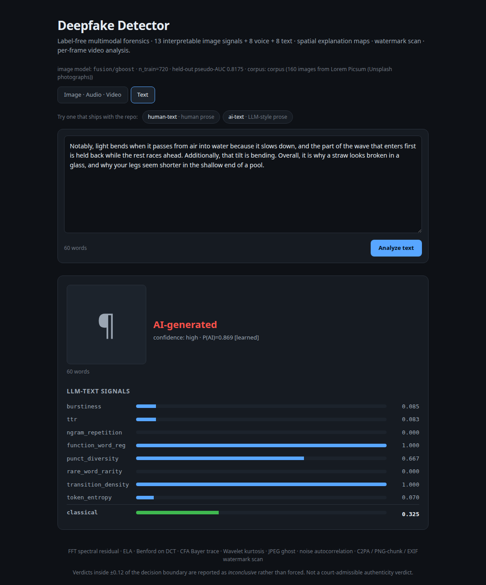
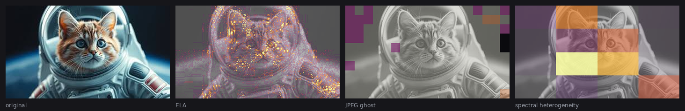
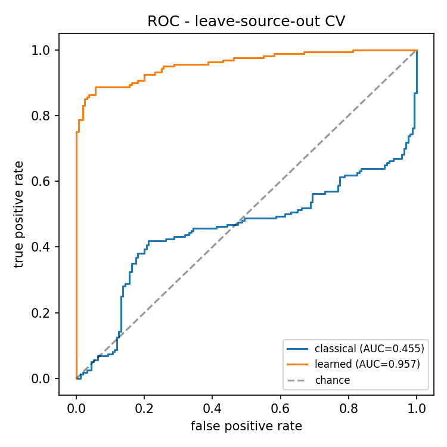
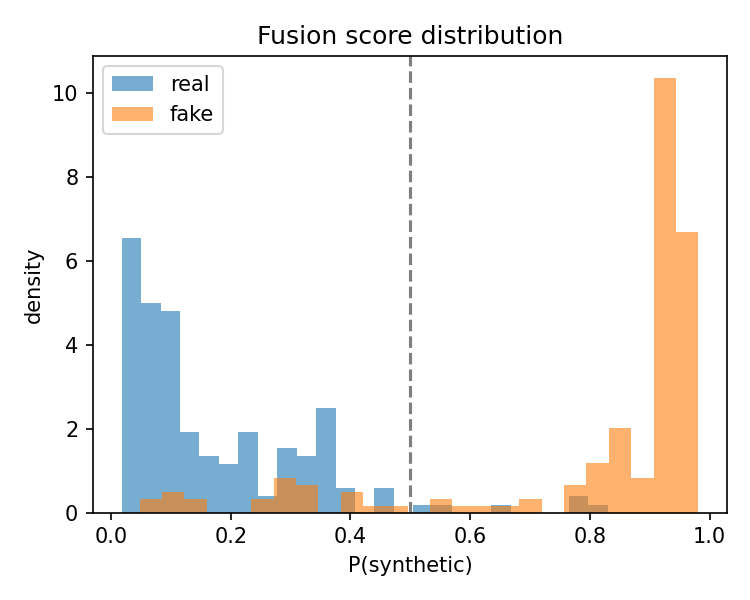

# Deepfake Detector — Label-Free Multimodal Synthetic-Media Detection

[](https://github.com/Developer1010x/deepfake-detector/actions/workflows/ci.yml)
[](LICENSE)
[](https://www.python.org/)
[](#installation)

A research-grade, **CPU-only, label-free** detector that estimates whether an **image**, an **audio clip** (synthetic / cloned voice), a **text passage** (LLM-generated), or a **video** was produced by a generative AI model.

One methodology is instantiated per modality:

> **unlabelled corpus → benign pseudo-real + artifact-injected pseudo-fake → interpretable forensic bank → calibrated classifier, under leave-source-out cross-validation.**

No labelled deepfakes are required — the system manufactures its own supervision from any unlabelled corpus, so it targets transferable *artifact families* rather than memorising one generator's fingerprint. Every score maps to a named, physically-motivated phenomenon, so each verdict is explainable — and now *spatially* explainable: the detector renders the two-dimensional fields its signals are computed from, instead of only reporting their collapsed scalars.



*`samples/fake/alpha-dog.jpg` in the web UI: the seven pixel signals, the spatial explanation maps, the pattern panel and the provenance scan. Reproduce with `python3 app.py` then open `/?demo=alpha-dog`.*

---

## Highlights

- **Four modalities** — image, audio, text, video — behind one CLI, one web UI and one API.
- **Label-free training** — synthesises pseudo-real / pseudo-fake pairs (cf. Self-Blended Images, CVPR 2022); no curated deepfake datasets needed.
- **Interpretable** — 13 hand-crafted forensic signals for images (+8 for audio, +8 for text), each a named signal-processing / statistical cue.
- **Spatially explainable** — ELA, JPEG-ghost and per-tile spectral fields rendered as heat-map overlays, not just numbers ([see below](#spatial-explanation-maps)).
- **It abstains.** Probabilities within ±0.12 of the boundary are reported as *inconclusive* rather than forced into a real/fake call.
- **Batch triage** — point it at a folder of unlabelled media and get a ranked worklist plus a CSV ([see below](#batch-triage)).
- **Hybrid for images** — frozen ImageNet backbone (dual-stream spatial + Fourier) fused with the forensic bank by a calibrated classifier.
- **Runs anywhere** — pure CPU, no GPU required; the classical path needs only numpy + Pillow.
- **Every artifact carries a model card** — corpus provenance, sample counts and library versions in `models/*.meta.json`, re-checked on load.

---

## Installation

```bash
git clone https://github.com/Developer1010x/deepfake-detector.git
cd deepfake-detector

pip install -r requirements.txt
# CPU-only torch is sufficient:
pip install torch torchvision --index-url https://download.pytorch.org/whl/cpu

# Optional system binary — decoding non-WAV audio and video audio-tracks needs ffmpeg:
#   sudo apt-get install ffmpeg
```

Python 3.10+ recommended.

> **First image inference downloads ~45 MB.** The shipped `models/fusion.joblib`
> uses the deep stream, so the first run fetches the ResNet-18 ImageNet weights
> into the torch hub cache. Set `DEEPFAKE_OFFLINE=1` to refuse the download; the
> tool then falls back to the classical combiner and says so, instead of hanging
> on a socket or silently downgrading.

---

## Quick start

Everything below runs against files that ship with the repository.

```bash
# Image — the seven signals, the fused probability, the watermark scan
python3 cli.py image samples/fake/alpha-dog.jpg

# ...and the spatial explanation maps as PNGs
python3 cli.py image samples/fake/cat-astronaut.jpeg --explain /tmp/maps

# Audio (procedural demo pair — see samples/demo/README.md)
python3 cli.py audio samples/demo/pseudo-real-voice.wav
python3 cli.py audio samples/demo/pseudo-fake-voice.wav

# Video — per-frame fusion + temporal instability + the extracted audio track
python3 cli.py video samples/demo/pseudo-fake-clip.mp4 --every 12

# Text
python3 cli.py text samples/demo/pseudo-ai.txt      # or:  echo "..." | python3 cli.py text -

# Watermark / provenance scan only
python3 cli.py watermark samples/fake/alpha-dog.jpg

# Batch triage — rank a folder of unlabelled media, write a ranked CSV
python3 cli.py batch samples --csv /tmp/triage.csv

# Web UI + multimodal API (image · audio · video · text)
python3 app.py                                      # http://localhost:5000
```

Model artifacts resolve relative to the source tree, so every command above works
from any working directory.

```
$ python3 cli.py image samples/fake/alpha-dog.jpg
alpha-dog.jpg
  fft        : 0.487
  ela        : 0.774
  benford    : 0.054
  cfa        : 0.914
  wavelet    : 0.345
  jpeg_ghost : 0.000
  noise      : 0.650
  pattern    : 0.099
  classical  : 0.455
  FUSION P(synthetic): 0.709  [fusion/gboost model]
  watermark  : 0.150  -> no watermark detected
    - circumstantial: matches Pillow / libjpeg default QT at quality 90
  => possibly AI-generated  (confidence: medium)

$ python3 cli.py audio samples/demo/pseudo-fake-voice.wav
pseudo-fake-voice.wav
  spectral_flatness    : 0.935
  hf_deficit           : 0.410
  phase_incoherence    : 0.583
  jitter_deficit       : 0.351
  shimmer_deficit      : 0.793
  hnr_anomaly          : 0.167
  modulation_anomaly   : 0.335
  noisefloor_regularity: 0.932
  classical  : 0.472
  LEARNED P(synthetic): 0.899  [audio.joblib]
  duration   : 4.0s @ 16000 Hz
  => likely synthetic / cloned voice  (confidence: high)
```

### Web API

| Route | Method | Purpose |
|---|---|---|
| `/` | GET | Web UI — drop an image / audio clip / video, or paste text. `?demo=<key>` runs a shipped sample on load. |
| `/analyze` | POST | Analyze an uploaded media file (image, audio or video) |
| `/analyze_text` | POST | Analyze a text passage (≥ 25 words) |
| `/analyze_sample` | POST | Analyze a shipped sample by catalog key (`{"name": "alpha-dog"}`) |
| `/samples/<key>` | GET | Serve a shipped sample for inline preview |

```bash
curl -X POST -F "file=@samples/fake/alpha-dog.jpg" http://127.0.0.1:5000/analyze
curl -X POST http://127.0.0.1:5000/analyze_text \
     -H "Content-Type: application/json" -d '{"text":"..."}'
```

`/analyze` on an image also returns an `explanations` array of base64 PNG heat-map overlays.

| Video — per-frame timeline | Audio | Text |
|---|---|---|
|  |  |  |

*The video panel spells out the fusion — per-frame mean, temporal σ, and the
separately-scored audio track — because any one of the three can raise the flag.
The clip is `samples/demo/pseudo-fake-clip.mp4`: a Ken-Burns pan over the
repository's own `samples/real/iphone-photo.jpg` with generation artifacts
injected per frame. It is **not** a deepfake of anyone; see
[`samples/demo/README.md`](samples/demo/README.md).*

---

## Batch triage

`evaluate.py` answers the research question — *how well does this separate two
labelled piles?* The forensic question is the other one: **here are 500 files
nobody has looked at; which twenty should a human open first?**

```bash
python3 cli.py batch evidence/ --csv triage.csv          # images + audio, recursive
python3 cli.py batch evidence/ --kind image --top 40     # images only, longer table
python3 cli.py batch evidence/ --no-watermark --csv -    # skip provenance scan, CSV to stdout
```

```
$ python3 cli.py batch samples --csv /tmp/triage.csv
model: fusion/gboost (fusion.joblib, n_train=720)
scanning 6 files under samples  (+2 video skipped — use `cli.py video`)

  #  P(syn)  kind   verdict                               top signal               wm  file
-------------------------------------------------------------------------------------------
  1   0.899  audio  likely synthetic / cloned voice       spectral_flatness         -  samples/demo/pseudo-fake-voice.wav
  2   0.709  image  possibly AI-generated                 cfa                    0.15  samples/fake/alpha-dog.jpg
  3   0.607  image  inconclusive - insufficient evidence  cfa                    0.00  samples/fake/cat-astronaut.jpeg
  4   0.354  image  likely real                           cfa                    0.15  samples/real/iphone-photo.jpg
  5   0.316  image  likely real                           cfa                    0.00  samples/fake/portrait.jpeg
  6   0.112  audio  likely real voice                     spectral_flatness         -  samples/demo/pseudo-real-voice.wav

6 of 6 shown  ·  flagged 2 (watermarked 0)  ·  inconclusive 1  ·  likely real 3  ·  unreadable 0
wrote 6 ranked rows to /tmp/triage.csv
```

Not a loop over the single-file path:

- **Batched features.** Images are scored in chunks (`batch.CHUNK`), so the 13-d
  hand-crafted block and the 1024-d deep embedding are each extracted once per
  chunk through the vectorised `FusionModel.predict_proba`, not once per file.
  160 photographs at ~1000 px take about two minutes on a laptop CPU.
- **One ranking across modalities.** Images and audio share the table, the
  calibrated probability, the ±0.12 abstention band and the provenance override,
  so a mixed evidence folder is triaged in a single pass. Videos are counted and
  reported as skipped rather than silently ignored.
- **Every file is accounted for.** Undecodable files come back with an `error`
  column and sort to the bottom; a triage list that quietly drops files is worse
  than no list.
- **A reason, not just a rank.** `top_signal` is the signal making the largest
  *weighted* contribution to that file's classical score.

The CSV carries the full ranking (`rank, path, kind, prob_synthetic, verdict,
confidence, decision_source, classical, top_signal, top_signal_value,
watermark_score, watermark_verdict, duration_s, error`) — the `--top` table is
only what is printed. This is the mode where the honest caveat below ("the
strength is ranking, not thresholding") stops being an apology.

---

## Spatial explanation maps

Three of the seven pixel signals are computed from a full two-dimensional field
and then thrown away down to one number. `explain.py` renders the field instead:

| Signal | Field it computes | What used to be kept |
|---|---|---|
| `ela` | per-pixel re-save error, `(H, W, 3)` | one ratio |
| `jpeg_ghost` | per-16px-block best-fit quality, `(H/16, W/16)` | its standard deviation |
| `block_hetero` | per-tile FFT score, `(n, n)` | its standard deviation |



*`samples/fake/cat-astronaut.jpeg`. ELA lights the inpainted fur and helmet rim;
the JPEG-ghost field is quality-90 almost everywhere with a scatter of blocks
that fit a different quality; the 8×8 spectral tiles are visibly heterogeneous.
Generated by `python3 cli.py image ... --explain DIR`.*

Overlay opacity is modulated by the signal itself, so a flat field renders as a
plain desaturated photograph — the correct reading of "this signal found nothing
spatially anomalous" — while hot regions glow. `jpeg_ghost` needs one extra step,
because its colour is a *quality label* rather than an anomaly: the colour is
scaled against the fixed quality domain (so the same colour means the same
quality in every image) while the opacity tracks each block's disagreement with
the frame's dominant compression history. A single-source photo is uniformly
"q=90" and therefore renders quiet; only blocks that fit a different quality
light up. All of it is numpy + Pillow; the web path never imports matplotlib.

---

## How it works

The same label-free recipe is instantiated across modalities — each track ships an interpretable forensic bank, a self-supervised pseudo-fake generator, and a leave-source-out evaluation harness.

| Modality | Detector / signals | Self-supervision | Eval | Inference |
|---|---|---|---|---|
| **Image** | `detector.py` (7 stats) + `patterns.py` + `deep_features.py` → `fusion.py` | `selfsup.py` (5 image artifacts) | `evaluate.py` | `cli.py image`, web upload |
| **Audio** | `audio_detect.py` (8 voice-forensic signals) | `audio_selfsup.py` (griffin-lim phase, mel over-smooth, band-limit, harmonic comb, noise gate) | `evaluate_audio.py` | `cli.py audio`, web upload, fused into video |
| **Text** | `text_detect.py` (8 LLM signals) | `text_selfsup.py` (flatten burstiness, inject repetition, lexical smoothing) | `evaluate_text.py` | `cli.py text`, `POST /analyze_text` |
| **Video** | per-frame image fusion + temporal instability + extracted audio track (`audio_io.py`) | — | — | `cli.py video`, web upload |

### The seven image signals

Each computes a score in `[0, 1]` (higher = more synthetic-looking), every one tied to a named physical phenomenon:

| Signal | What it catches |
|---|---|
| **FFT spectral** | upsampler periodicity — peaks/ringing that break the `1/f^α` natural-image power law |
| **Error Level Analysis** | uneven JPEG re-save error from splicing / mixed compression history |
| **Benford's law (DCT)** | leading-digit distribution of AC DCT coefficients drifting off Benford |
| **CFA / Bayer trace** | absence of the 2×2 demosaicing fingerprint left by camera sensors |
| **Wavelet kurtosis** | detail sub-bands that aren't as heavy-tailed as natural images |
| **JPEG ghost** | spatial inconsistency in the best-fit re-encoding quality |
| **Noise residual** | spatially *correlated* high-pass residual (real sensor noise is ~white) |

The learned model consumes **13** interpretable features: these 7 pixel statistics
plus 6 descriptors emitted by the **three** pattern checks in `patterns.py` — one
score each from `spectral_peak_pattern`, `block_heterogeneity` and `lbp_pattern`,
plus the LBP uniform mass and entropy, plus the weighted `pattern_score`.
`fusion.PATTERN_NAMES` is the authoritative list.

A separate **watermark / provenance scanner** (`watermark.py`) inspects the file
itself, and splits what it finds into two classes that are *not* treated alike:

| Class | Evidence | Effect |
|---|---|---|
| **Provenance** | C2PA / Content Credentials manifest · a diffusion UI's PNG `parameters` / `workflow` chunk · an EXIF field naming a generator · a generator name inside a JPEG APPn/COM segment | hard override: "AI-generated", high confidence |
| **Circumstantial** | quantization tables matching the libjpeg defaults (0.15) · mid-band spectral anomaly (≤ 0.25) | raises the score, capped below the 0.5 reporting threshold, never overrides |

The split is not pedantry. Sweeping *whole-file* bytes for generator names finds
them inside JPEG entropy data by chance, and the spectral heuristic assumed
"natural mid-band kurtosis is 3–8" when the measured distribution over 160 real
photographs is p50 6.1 / p90 23.2 / p95 36.9 / max 133.8. Together those two made
the scanner declare **21 of 160 genuine photographs** watermarked — and because a
provenance hit overrides the pixel verdict, each one became a *high-confidence*
false positive. Keyword search is now scoped to metadata segments, the kurtosis
knee sits at the measured p95, and statistics alone can no longer assert a
watermark. Same corpus after: **0**.

### Abstention

`pipeline.INCONCLUSIVE_MARGIN = 0.12`. Inside `0.5 ± 0.12` the tool reports
**"inconclusive — insufficient evidence"** for every modality rather than
committing. This is not cosmetic: a calibrated classifier at p = 0.49 is telling
you it cannot separate the classes for this input, and saying so is the
difference between a forensic instrument and a coin flip with a progress bar.

---

## What the shipped models actually are

Every artifact in `models/` has a `*.meta.json` model card recording the corpus it
was fitted on, its sample counts and the library versions that pickled it.
`pipeline` re-checks the versions on load and reports a mismatch instead of
silently degrading. A present-but-unloadable artifact is reported as an **error**
with the real exception, never as "no trained model".

### `models/fusion.joblib` — image

| | |
|---|---|
| Corpus | **160 real photographs** fetched by `fetch_corpus.py` (Lorem Picsum / Unsplash), whole-image sources, 3 views each |
| Training set | 720 pseudo-samples (360 pseudo-real / 360 pseudo-fake) |
| Model | `gboost` fusion (13 hand-crafted ⊕ 64 deep PCs), sigmoid-calibrated, cv=3 |
| Held-out pseudo-AUC | 0.818 |

Measured on **30 photographs that were never in the training corpus** (`fetch_corpus.py` ids 160–189), each paired with its own pseudo-fake:

| Artifact | ROC-AUC | acc @ 0.5 | false-positive rate |
|---|---|---|---|
| previous release (fitted on 128px tiles of the 4 images in `samples/`) | 0.631 | 0.617 | **0.500** |
| **current** (160 photographs) | **0.717** | **0.667** | **0.300** |

Reproduce the artifact with:

```bash
python3 fetch_corpus.py --n 160
python3 train_selfsup.py --patch 0 --per-image 3
```

On its own demo images the current model scores
`alpha-dog 0.709` ✓, `cat-astronaut 0.607` ✓ (inside the abstention band, so
reported as inconclusive), `iphone-photo 0.354` ✓ and `portrait 0.316` ✗ — three
of four, with the one miss documented under [Honest limitations](#honest-limitations).

### `models/audio.joblib` — voice

Fitted on `audio_selfsup.synth_corpus`: **both classes are procedurally
synthesised**, so this model has never heard a human voice. Its 0.957 AUC is the
separability of the injected artifacts, not a deployment number.

### `models/text.joblib` — text

Fitted on the `text_selfsup` pseudo corpus (704 samples). It is now shipped, so
the text track no longer silently falls back to the training-free combiner — but
see the table below: on real HC3 data the learned model **ranks worse** than the
classical combiner (0.825 vs 0.960 AUC) while being far more usable at the 0.5
threshold (F1 0.781 vs 0.398). Both numbers are in `paper/results_text.md`.

---

## Evaluation & external validation

```bash
# Self-supervised metrics + the figures below (needs corpus/, see fetch_corpus.py)
python3 evaluate.py --folds 5 --per-image 2
python3 evaluate_audio.py
python3 evaluate_text.py

# Real datasets — downloaded automatically, no manual fetch step
python3 prepare_datasets.py                       # CIFAKE (8 MB) + HC3 open_qa (3 MB)
python3 prepare_datasets.py --hc3-file all.jsonl  # the full 73 MB HC3 split
python3 evaluate_text.py --real datasets/hc3/human  --fake datasets/hc3/ai
python3 evaluate.py      --real datasets/cifake/real --fake datasets/cifake/fake
```

`datasets/` and `corpus/` are git-ignored; both are reproducible from the scripts
above. `paper/` **is** committed — the figures and metric tables below are the
files those commands write.

### Image — leave-source-out CV (`paper/results.md`)

160 photographs → 160 independent sources → 640 pseudo-samples, `GroupKFold(5)`
on the source id so no view of a photo straddles a fold. Every number here was
produced by the command above and is the file `paper/results.md` on disk:

| Model | ROC-AUC | AP | Acc | F1 | Brier |
|---|---|---|---|---|---|
| classical (fixed weights, training-free) | 0.546 | 0.538 | 0.559 | 0.561 | 0.250 |
| hand-crafted (learned, 13-d) | 0.751 ±0.028 | 0.813 | 0.706 | 0.679 | 0.194 |
| deep (dual-stream, 64 PCs) | 0.595 ±0.013 | 0.580 | 0.575 | 0.615 | 0.244 |
| **fusion** | **0.777 ±0.015** | **0.823** | 0.694 | **0.682** | **0.189** |

<p align="center">
  
  
  
  
  
  
</p>

The ablation is the point: fusion (0.777) beats hand-crafted alone (0.751), which
beats the deep stream alone (0.595), which beats the training-free combiner
(0.546). Per-artifact recall says *why* — `upsample_fingerprint` 0.962 and
`diffusion_smooth` 0.872 are caught almost every time, while `spectral_inject`
(0.485) and `double_jpeg` (0.521) are barely above chance.

> **This is lower than the 0.853 an earlier version of this README quoted, and
> the difference is protocol, not regression.** That figure came from evaluating
> on 128×128 tiles, where one image contributes dozens of small, statistically
> homogeneous sources. These numbers are whole photographs at ~1024 px — the
> resolution at which the tool is actually used — which is a harder and more
> honest test. `--patch 128` reproduces the tiled protocol if you want to compare
> (expect ~15k samples and a much longer run).

**External validation on CIFAKE** — the same fusion model, trained on the pseudo
corpus only, tested against 300 real CIFAR-10 photographs vs 300
Stable-Diffusion images:

| Metric | Value |
|---|---|
| ROC-AUC | **0.553** |
| accuracy | 0.527 |
| F1 | 0.576 |
| Brier | 0.257 |

That is barely above chance, and it is in the README because it is the honest
result. CIFAKE is 32×32: at that size the radial spectrum has ~16 usable bins,
the JPEG-ghost grid is a single 16-px block, and the 8×8 tile field does not
exist at all. The signals this project implements need resolution to measure
anything, and the number says so.


### Audio — leave-source-out CV (`paper/results_audio.md`)

| Model | ROC-AUC | AP | Acc | F1 | Brier |
|---|---|---|---|---|---|
| classical (fixed weights) | 0.455 | 0.513 | 0.572 | 0.402 | 0.264 |
| **learned bank** | **0.957 ±0.015** | 0.968 | 0.909 | 0.904 | 0.074 |

<p align="center">
  
  
</p>

Per-artifact recall: `mel_oversmooth` 0.981, `griffin_lim_phase` 0.944,
`harmonic_comb` 0.913, `band_limit` 0.841, `noise_gate` 0.792.

### Text — leave-source-out CV + real HC3 (`paper/results_text.md`)

| Model | Self-supervised AUC | HC3 AUC | HC3 F1 @ 0.5 |
|---|---|---|---|
| classical (training-free) | 0.663 | **0.960** | 0.398 |
| **learned bank** | **0.760 ±0.061** | 0.825 | **0.781** |

The 0.960 figure is the *training-free* combiner on 300 human vs 300 ChatGPT
answers from the full `all.jsonl` HC3 split — reproduced with the two commands
above. It is a **ranking** number: at a fixed 0.5 threshold that same combiner
only reaches F1 0.398, which is exactly why the learned model ships.

---

## Project layout

```
deepfake-detector/
├── cli.py                 # unified CLI: image / video / audio / text / watermark / batch
├── app.py                 # Flask web UI + multimodal API (all four modalities)
├── pipeline.py            # unified inference (fusion → classical → watermark → abstention)
├── batch.py               # folder triage: batched scoring, ranking, CSV export
│
├── detector.py            # 7 interpretable pixel signals + the fields behind them
├── patterns.py            # 3 pattern checks -> 6 descriptors
├── explain.py             # spatial explanation maps (ELA / JPEG-ghost / per-tile FFT)
├── deep_features.py       # frozen ResNet-18 dual-stream (spatial + spectral) embedding
├── fusion.py              # hybrid calibrated classifier (deep ⊕ hand-crafted)
├── selfsup.py             # label-free pseudo-real / pseudo-fake generator (image)
├── watermark.py           # AI watermark / metadata / provenance scanner
│
├── audio_detect.py        # 8 voice-forensic signals
├── audio_selfsup.py       # audio pseudo-fake generator
├── audio_io.py            # audio decode / video audio-track extraction
│
├── text_detect.py         # 8 LLM-text signals
├── text_selfsup.py        # text pseudo-fake generator
│
├── fetch_corpus.py        # reproducible real-photograph corpus  -> corpus/
├── train_selfsup.py       # image self-supervised training       -> models/fusion.joblib
├── train_audio.py         # audio training                       -> models/audio.joblib
├── train_text.py          # text training                        -> models/text.joblib
├── make_demo_media.py     # procedural audio/video/text demos    -> samples/demo/
├── evaluate.py            # image leave-source-out CV + ablation + figures
├── evaluate_audio.py      # audio evaluation
├── evaluate_text.py       # text evaluation
├── prepare_datasets.py    # download + decode HC3 / CIFAKE into labelled folders
│
├── models/                # shipped artifacts (*.joblib) + model cards (*.meta.json)
├── samples/               # example real/ and fake/ images, demo/ audio + video + text
├── paper/                 # committed metric tables and figures
├── docs/screenshots/      # committed UI screenshots
├── tests/                 # property tests: DSP primitives, watermark, explain, batch
├── templates/ · static/   # web UI
├── .github/workflows/     # CI
├── requirements.txt
└── Procfile               # gunicorn entry for deployment
```

---

## Tests

```bash
pytest          # 57 tests, a few seconds, numpy + pillow only
```

They assert the invariants the hand-rolled primitives are supposed to satisfy —
Haar DWT perfect reconstruction and energy conservation, `istft(stft(x)) ≈ x` in
the COLA-valid interior, orthonormality of the 8×8 DCT-II matrix, Hann COLA
compliance at hop = N/4, that the 58 "uniform" LBP codes are exactly the codes
with ≤ 2 circular bit transitions, that the spatial fields `explain.py` renders
agree with the scalars the signals report, and that every signal stays inside
`[0, 1]` on degenerate input.

Three further files pin the behaviour that is easy to get quietly wrong:

- `test_watermark.py` — markers a generator writes are detected; a `Software:
  GIMP` chunk, libjpeg-default quantization tables and a generator name spliced
  into JPEG *scan* data are not. Every one of those used to produce a
  high-confidence "AI-generated" verdict.
- `test_explain.py` — a field with nothing in it renders as the plain
  photograph, a spliced frame renders louder than a clean one, and maps that
  cannot be computed are omitted rather than faked.
- `test_batch.py` — triage returns every file it was given (failures included),
  ranks by descending probability, and never disagrees with the single-file path
  about the same file.

CI runs them on Python 3.10 and 3.12 and additionally imports the classical path
with torch / sklearn / OpenCV blocked, to keep the "no heavy dependencies for the
classical path" claim true.

---

## Honest limitations

- **Modern diffusion models** (Karras-style anti-aliased upsamplers, JPEG
  augmentation, spectral regularization — most 2024+ models) deliberately
  suppress the spectral fingerprints the FFT signal looks for.
  `samples/fake/portrait.jpeg` is exactly this case and the shipped model still
  scores it 0.316, i.e. wrong. It is left in the repository rather than quietly
  removed.
- **CIFAKE is close to chance: 0.553 AUC, measured.** The 32×32 CIFAKE images are
  far outside the resolution the signals need — at that size the radial spectrum
  has ~16 usable bins and the tiled fields collapse to a single block. The
  command that produces the number is in the README precisely because the number
  is unflattering.
- **JPEG round-trips destroy signal** — screenshots, re-saves, and messaging-app
  re-encoding make every signal noisier.
- **Adversarial post-processing** (slight noise, low-pass, a quality-75 JPEG
  cycle) can drop the scores; a non-learning detector has no defence.
- **The audio corpus is procedural for both classes.** `models/audio.joblib` has
  never heard a human voice, and it visibly under-detects `noise_gate`-only fakes
  (P ≈ 0.29 — measured; see `samples/demo/README.md`).
- **The clips in `samples/demo/` are generated, not captured.** They exist so the
  audio, video and text paths can be run at all, and every one of them is
  labelled as a stand-in.
- **Thresholds are calibrated, not absolute** — validate on a labelled benchmark
  (`evaluate.py --real DIR --fake DIR`) before trusting this anywhere that matters.

What this tool *is*: a strong, reproducible, explainable baseline for
understanding how generators differ from cameras / cloned voices / human writing
at the signal level. What it *isn't*: a production authenticity guarantee, or a
court-admissible verdict.

---

## License

Released under the [MIT License](LICENSE).
