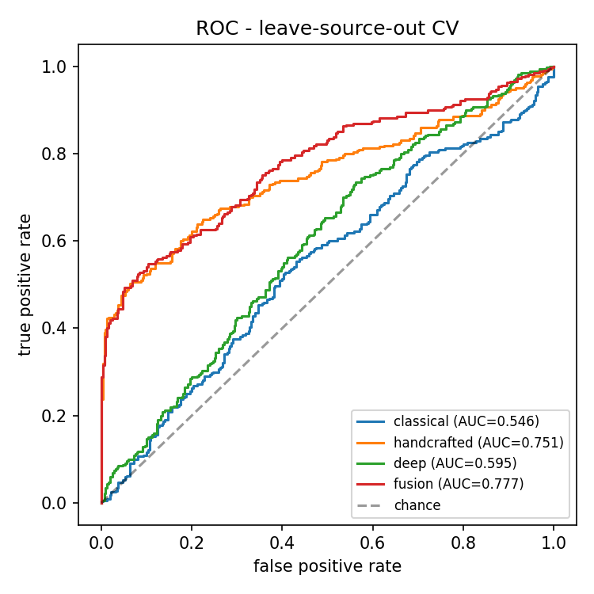
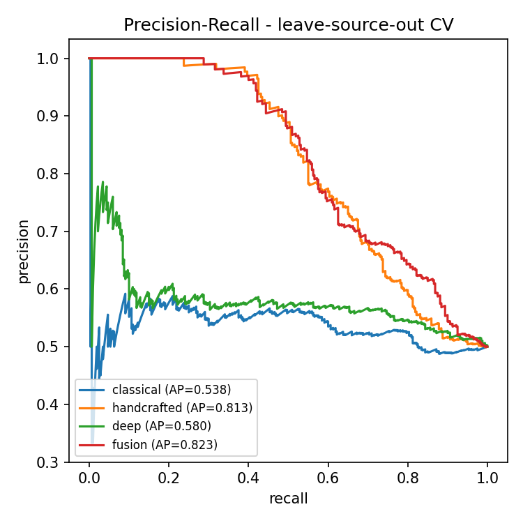
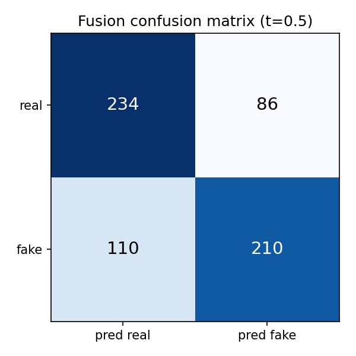
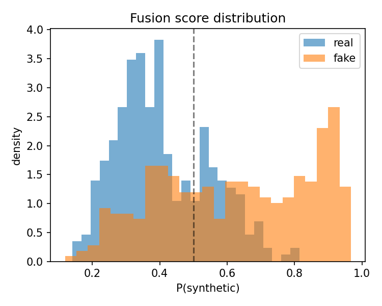
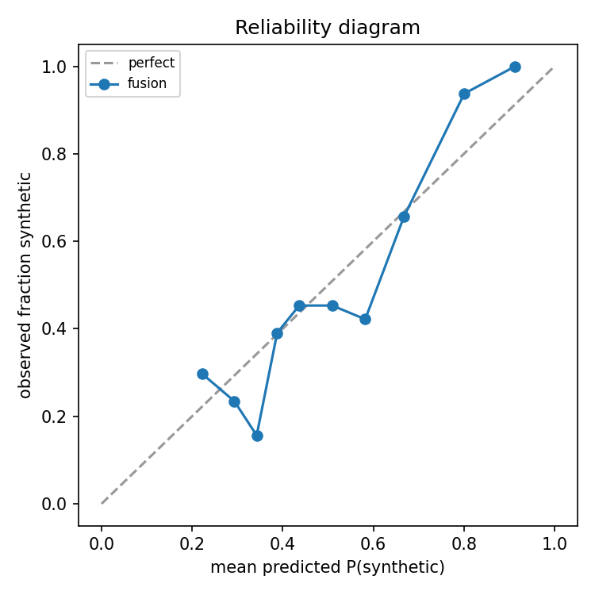
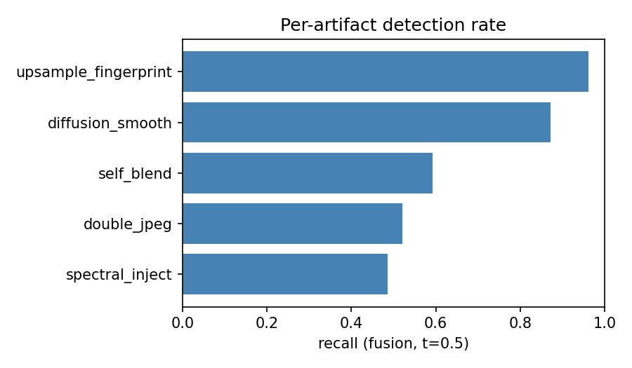

# Evaluation results

_Protocol: leave-source-out 5-fold GroupKFold (classifier=gboost, seed=0)_  
_Corpus: 160 images -> 160 sources -> 640 pseudo-samples (320 real / 320 fake)_

## Ablation (cross-validated out-of-fold)

| Model | AUC | AP | Acc | Precision | Recall | F1 | Brier |
|---|---|---|---|---|---|---|---|
| classical (fixed weights) | 0.546 | 0.538 | 0.559 | 0.559 | 0.562 | 0.561 | 0.250 |
| handcrafted | 0.751 ±0.028 | 0.813 | 0.706 | 0.748 | 0.622 | 0.679 | 0.194 |
| deep | 0.595 ±0.013 | 0.580 | 0.575 | 0.562 | 0.678 | 0.615 | 0.244 |
| fusion | 0.777 ±0.015 | 0.823 | 0.694 | 0.709 | 0.656 | 0.682 | 0.189 |

## Per-artifact recall (fusion)

| Artifact | Recall | n |
|---|---|---|
| spectral_inject | 0.485 | 101 |
| double_jpeg | 0.521 | 94 |
| self_blend | 0.592 | 98 |
| diffusion_smooth | 0.872 | 94 |
| upsample_fingerprint | 0.962 | 104 |

## External validation (labelled test set)

| Metric | Value |
|---|---|
| auc | 0.553 |
| ap | 0.562 |
| accuracy | 0.527 |
| precision | 0.522 |
| recall | 0.643 |
| f1 | 0.576 |
| brier | 0.257 |

## Figures

