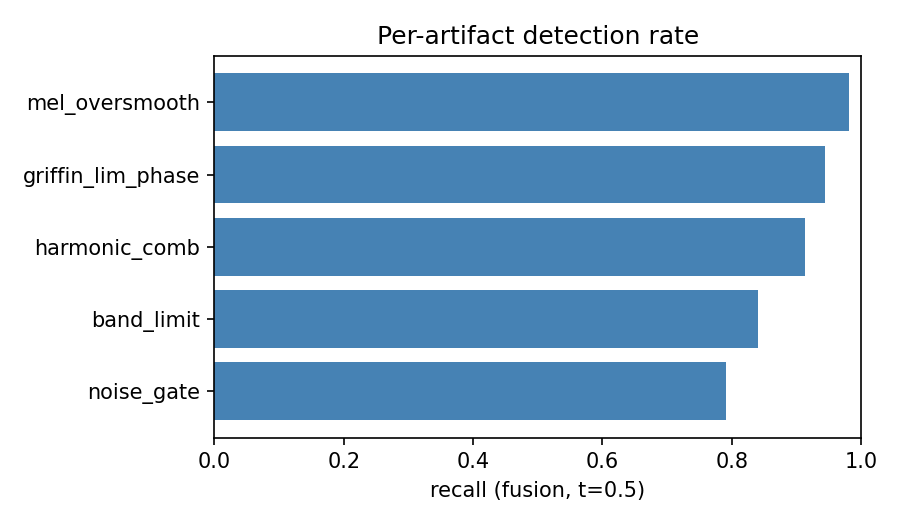

# Audio-deepfake evaluation results

_Protocol: leave-source-out 5-fold GroupKFold (gboost, seed=0)_  
_Corpus: 40 synthetic utterances -> 320 pseudo-samples (160 real / 160 fake)_

## Ablation (leave-source-out, out-of-fold)

| Model | AUC | AP | Acc | Precision | Recall | F1 | Brier |
|---|---|---|---|---|---|---|---|
| classical (fixed weights) | 0.455 | 0.513 | 0.572 | 0.667 | 0.287 | 0.402 | 0.264 |
| learned (handcrafted) | 0.957 ±0.015 | 0.968 | 0.909 | 0.958 | 0.856 | 0.904 | 0.074 |

## Per-artifact recall (learned)

| Artifact | Recall | n |
|---|---|---|
| noise_gate | 0.792 | 48 |
| band_limit | 0.841 | 44 |
| harmonic_comb | 0.913 | 46 |
| griffin_lim_phase | 0.944 | 54 |
| mel_oversmooth | 0.981 | 53 |

## Figures

